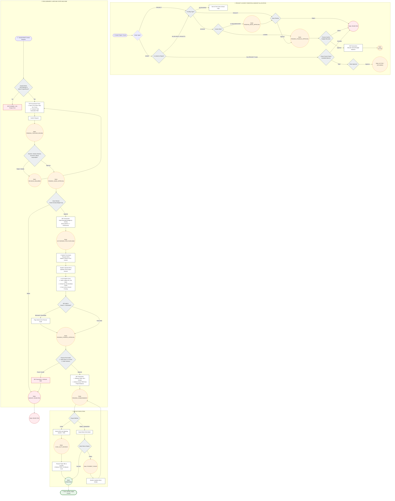
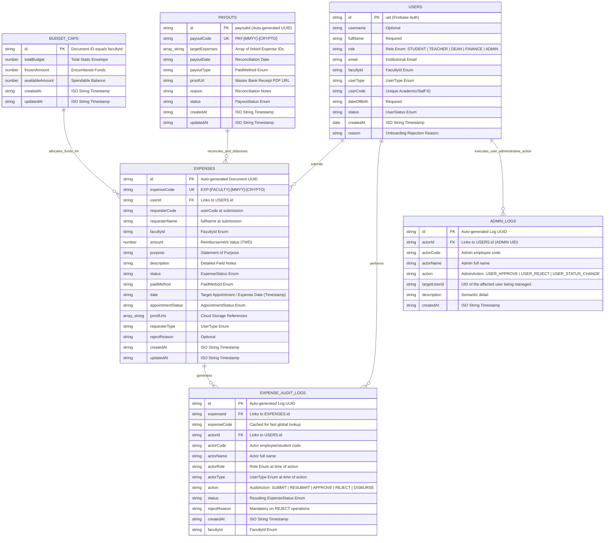

```mermaid
graph TB
    %% Define DDD Architecture Styles
    classDef client fill:#e3f2fd,stroke:#1565c0,stroke-width:1.5px;
    classDef backend fill:#f3e5f5,stroke:#7b1fa2,stroke-width:1.5px;
    classDef shared fill:#fffde7,stroke:#fbc02d,stroke-width:1.5px;
    classDef infra fill:#fff3e0,stroke:#ef6c00,stroke-width:2px;
    
    %% STRICT DATA ABSTRACTION LAYER CLASS (The Interface/Repository boundaries)
    classDef data_abstraction fill:#e0f2f1,stroke:#004d40,stroke-width:2.5px;
    
    %% Styled specifically for planned components to signal Phase 2 Roadmap
    classDef planned fill:#f5f5f5,stroke:#9e9e9e,stroke-width:1.5px,stroke-dasharray: 5 5;

    subgraph Workspace_Monorepo ["📦 NX MONOREPO WORKSPACE BOUNDARY (Enterprise Scale)"]
        
        %% --- FRONTEND CONTEXTS LAYER ---
        subgraph FE_Layer ["🖥️ FRONTEND LAYER (Domain-Driven Micro-Frontends)"]
            App_Shell["mfe-shell-angular<br/>(Angular Host Application)"]
            App_Remote["mfe-remote-react<br/>(React Remote Application)"]
            
            subgraph Expense_FE ["📦 EXPENSES BOUNDED CONTEXT"]
                FE_Exp_Feature["features<br/>(Smart Components / List & Modals)"]
                FE_Exp_DA["data-access<br/>(State Management & Angular Services)"]
            end
            
            subgraph Payout_FE ["📦 PAYOUT BOUNDED CONTEXT (Planned - Phase 2)"]
                FE_Pay_Feature["features<br/>(Batch Management Dashboard)"]
                FE_Pay_DA["data-access<br/>(Reconciliation Services)"]
            end
            
            subgraph Auth_FE ["📦 AUTH BOUNDED CONTEXT"]
                FE_Auth_Feature["features<br/>(Login & Route Guards)"]
                FE_Auth_DA["data-access<br/>(Signals Store / Auth State)"]
            end
            
            subgraph Finance_FE ["📦 FINANCE BOUNDED CONTEXT"]
                FE_Fin_Feature["features<br/>(Budget Manager Components)"]
                FE_Fin_DA["data-access<br/>(Budget HTTP Services)"]
            end
        end

        %% --- BACKEND CONTEXTS LAYER ---
        subgraph BE_Layer ["⚙️ APPLICATION LOGIC LAYER (NestJS Backend - apps/backend)"]
            subgraph Expense_BE ["📦 EXPENSES BACKEND DOMAIN"]
                BE_Exp_Ctrl["features-backend<br/>(Expense Controller Layer)"]
                BE_Exp_Service["data-access-backend<br/>(Domain Services & Tx Logic)"]
                BE_Exp_Repo["data-access-backend<br/>[DATA ABSTRACTION LAYER:<br/>Repository Interface Contract]"]
            end
            
            subgraph Payout_BE ["📦 PAYOUT BACKEND DOMAIN (Planned - Phase 2)"]
                BE_Pay_Ctrl["features-backend<br/>(Payout Batch Controller)"]
                BE_Pay_Service["data-access-backend<br/>(Bulk Transfer & PDF Parsing Logic)"]
                BE_Pay_Repo["data-access-backend<br/>[DATA ABSTRACTION LAYER:<br/>Storage Repository Contract]"]
            end
            
            subgraph Auth_BE ["📦 AUTH BACKEND DOMAIN"]
                BE_Auth_Ctrl["features-backend<br/>(Auth Controller & JWT Guards)"]
                BE_Auth_Service["data-access-backend<br/>(Session & Claims Services)"]
                BE_Auth_Repo["data-access-backend<br/>[DATA ABSTRACTION LAYER:<br/>Identity Provider Interface]"]
            end
            
            subgraph Finance_BE ["📦 FINANCE BACKEND DOMAIN"]
                BE_Fin_Ctrl["features-backend<br/>(Budget Controller Layer)"]
                BE_Fin_Service["data-access-backend<br/>(TWD Budget Allocation Logic)"]
                BE_Fin_Repo["data-access-backend<br/>[DATA ABSTRACTION LAYER:<br/>Budget Repository Contract]"]
            end
        end

        %% --- SHARED KERNEL ---
        subgraph Shared_Kernel ["💛 SHARED KERNEL (libs/shared/*)"]
            Shared_UI["ui & ui-react<br/>(Design System / DarkModeToggle)"]
            Shared_Tokens["tokens<br/>(Injection Tokens & Configuration)"]
            Shared_Types["types<br/>(Global Enums & Shared Interfaces)"]
        end
    end

    %% --- INFRASTRUCTURE ADAPTERS LAYER (Can be easily swapped out thanks to Repositories)
    subgraph Infrastructure ["🗄️ INFRASTRUCTURE ADAPTERS LAYER (Swappable Providers)"]
        FB_Auth["Firebase Authentication Adapter<br/>(Identity Service Gateway)"]
        Firestore[("Firebase Firestore Adapter<br/>(NoSQL Bounded Collections)")]
        Storage[("Firebase Cloud Storage Adapter<br/>(GUI Receipts & Master PDFs)")]
        BankBOT[["Bank of Taiwan App<br/>(Offline File-Based Clearing)"]]
    end

    %% Core Internal Backend Connections (Decoupled via Repositories)
    BE_Exp_Ctrl --> BE_Exp_Service
    BE_Exp_Service -->|"Calls Interface"| BE_Exp_Repo
    BE_Auth_Ctrl --> BE_Auth_Service
    BE_Auth_Service -->|"Calls Interface"| BE_Auth_Repo
    BE_Fin_Ctrl --> BE_Fin_Service
    BE_Fin_Service -->|"Calls Interface"| BE_Fin_Repo
    BE_Pay_Ctrl --> BE_Pay_Service
    BE_Pay_Service -->|"Calls Interface"| BE_Pay_Repo

    %% Frontend Apps Dependencies
    App_Shell -->|"Injects Features"| FE_Exp_Feature
    App_Shell -->|"Injects Features"| FE_Auth_Feature
    App_Shell -->|"Injects Features"| FE_Fin_Feature
    App_Shell -->|"Injects Features (Future)"| FE_Pay_Feature
    App_Remote -->|"Exposes Layout Feature"| App_Shell
    
    %% Tactical Layering Connections (Feature -> Data Access)
    FE_Exp_Feature --> FE_Exp_DA
    FE_Auth_Feature --> FE_Auth_DA
    FE_Fin_Feature --> FE_Fin_DA
    FE_Pay_Feature --> FE_Pay_DA
    
    %% REST API Network Boundaries
    FE_Exp_DA -->|"HTTPS REST API<br/>(JWT + App Check)"| BE_Exp_Ctrl
    FE_Auth_DA -->|"HTTPS REST API<br/>(JWT + App Check)"| BE_Auth_Ctrl
    FE_Fin_DA -->|"HTTPS REST API<br/>(JWT + App Check)"| BE_Fin_Ctrl
    FE_Pay_DA -->|"HTTPS REST API (Future)"| BE_Pay_Ctrl
    
    %% Core Async Communication between Domains (Decoupling)
    BE_Exp_Service -.->|"Triggers State Mutation Event"| BE_Pay_Ctrl
    
    %% Infrastructure Adapters Implementations (Bound STRICTLY to Repositories, NOT Services)
    BE_Exp_Repo -->|"Plugs Into"| Firestore
    BE_Exp_Repo -->|"Plugs Into"| Storage
    BE_Fin_Repo -->|"Plugs Into"| Firestore
    BE_Pay_Repo -.->|"Plugs Into"| Storage
    BE_Auth_Repo -->|"Plugs Into"| FB_Auth
    FE_Auth_DA -.->|"Direct Client Verification"| FB_Auth
    
    %% Shared Kernel Core Connections
    Shared_Types -.->|"Provides Contracts"| FE_Exp_DA
    Shared_Types -.->|"Provides Contracts"| BE_Exp_Ctrl
    Shared_UI -.->|"Provides Presentation Atoms"| App_Shell

    %% External System Boundary
    BE_Fin_Ctrl -.->|"Generates Batch Export Excel"| BankBOT
    BE_Pay_Service -.->|"Processes Bank Transfers (Future)"| BankBOT

    %% Apply DDD Architecture Styles to Nodes
    class App_Shell,App_Remote,FE_Exp_Feature,FE_Exp_DA,FE_Auth_Feature,FE_Auth_DA,FE_Fin_Feature,FE_Fin_DA client;
    class BE_Exp_Ctrl,BE_Exp_Service,BE_Auth_Ctrl,BE_Auth_Service,BE_Fin_Ctrl,BE_Fin_Service backend;
    class Shared_UI,Shared_Tokens,Shared_Types shared;
    class FB_Auth,Firestore,Storage,BankBOT infra;
    
    %% HIGHLIGHTING THE ACTUAL DATA ABSTRACTION LAYER (THE REPOSITORIES CONTRACTS)
    class BE_Exp_Repo,BE_Auth_Repo,BE_Fin_Repo data_abstraction;
    
    %% Apply Planned Roadmap Styles (Overriding for Phase 2 components)
    class FE_Pay_Feature,FE_Pay_DA,BE_Pay_Ctrl,BE_Pay_Service,BE_Pay_Repo planned;
```

```mermaid
graph TD
    %% Style Definitions
    classDef phase1 fill:#f5f5f5,stroke:#9e9e9e,stroke-width:1.5px,stroke-dasharray: 4 4;
    classDef phase2 fill:#e3f2fd,stroke:#1565c0,stroke-width:1.5px;
    classDef phase3 fill:#e8f5e9,stroke:#2e7d32,stroke-width:2px;
    classDef phase4 fill:#fff8e1,stroke:#ffb300,stroke-width:1.5px;

    %% Phases
    subgraph P1 ["🌱 PHASE 1: CLIENT-SIDE MONOLITH (13 Oct 2024 - May 27, 2025)"]
        M1["- Developed purely on Frontend using Angular 18<br/>- Utilized direct client-to-database integration with Firebase<br/>- Implemented basic personal Expense CRUD and native Firebase Auth"]
    end

    subgraph P2 ["🔧 PHASE 2: WORKSPACE OVERHAUL & MODERNIZATION (Jul 5, 2025 - Jun 5, 2026)"]
        M2["- Migrated codebase to an Nx Monorepo workspace ('micro-expense-tracker-personal')<br/>- Added NestJS backend layer operating on a hybrid MongoDB + Firebase infrastructure<br/>- Fabricated core UI elements and integrated initial React-wrapped SVG Chart components<br/>- <b>Late-Phase Architectural Shifts:</b> Dropped MongoDB; upgraded to Angular 22; shifted RxJS to native Signals; built Abstraction Layers"]
    end

    subgraph P3 ["🎯 PHASE 3: INSTITUTIONAL ECOSYSTEM PIVOT (Jun 6, 2026 - Present)"]
        M3["- Spawned current 'school-expense-ecosystem' repo; refactored scope to University Budget Management<br/>- Enforced Monorepo boundaries using explicit Nx Dependency Tags (project.json)<br/>- Hardened full-stack security via JWT Custom Claims, NestJS Throttling, and Firebase App Check<br/>- Fully deprecated Akita state management in favor of native Angular Signals Store<br/>- Engineered multi-role workflows, onboarding/rejection pipelines, and Admin user provisioning<br/>- <i>Isolated the decoupled Report charts for downstream synchronization</i>"]
    end

    subgraph P4 ["🚀 PHASE 4: ENTERPRISE HARDENING, LOCALIZATION & QA (Planned / Future Backlog)"]
        M4["- <b>1. Expense Specification Alignment:</b> Refine core validation to intercept duplicate tax invoices and verify vendor compliance data<br/>- <b>2. Downstream Report Refactoring:</b> Re-engineer Report Chart bindings to seamlessly consume finalized institutional Expense schemas<br/>- <b>3. Budget Ledger & Payout Realization:</b> Code transactional ledger workflows and state machines to manage atomic balance freezing and bulk bank reconciliations<br/>- <b>4. Cash Payout Appointment Scheduling:</b> Build capacity-controlled slot booking components and background Midnight Cron Jobs to release expired slots<br/>- <b>5. Cross-Border Internationalization & Localization (i18n):</b> Integrate Angular i18n / Transloco to support Traditional Chinese (zh-TW) and localize currency formats (TWD) for Taiwanese academic standards<br/>- <b>6. Automated Testing Suite:</b> Write Jest unit/integration tests for NestJS controllers and Cypress E2E test scripts for multi-role workflows"]
    end

    %% Flow Links
    M1 -->|Complete Engineering Re-write| M2
    M2 -->|Domain Scope Expansion| M3
    M3 -->|System Hardening Pipeline| M4

    %% Apply Styles
    class M1 phase1;
    class M2 phase2;
    class M3 phase3;
    class M4 phase4;
```

### 📑 Core Modules Flowcharts

<b>1.User Management Business Logic Flowchart (Click to expand)</b>

  

<b>2.Business Logic Flowchart for Expense Management & Payout Lifecycle  (Click to expand)</b>

  

<b>3. High-level Architectural Block Diagram (Click to expand)</b>

  

<b>4. Firestore NoSQL Data Model Diagram (Click to expand)</b>

  

  
<b>5. Technical Project Roadmap (Click to expand)</b>

  

  

<b>6.  Functional Access Control Matrix (RBAC) (Click to expand)</b>

| Menu Item | Student | Staff (Requester) | Teacher (Reviewer) | Faculty Dean | Architectural Responsibility & Business Rules |
| :--- | :---: | :---: | :---: | :---: | :--- |
| **Dashboard** | ✅ | ✅ | ✅ | ✅ | General landing workspace for tracking personal claim timelines and operational metrics. |
| **My Expenses** | ✅ | ✅ | ✅ | ✅ | Personal reimbursement management. Students are capped at 2,000 TWD, while Staff/Teachers are capped at 10,000 TWD per claim. |
| **Approval Center** | ❌ | ❌ | ✅ | ✅ | **Teachers:** Review initial student submissions (`PENDING_TEACHER_REVIEW`). **Deans:** Review faculty-wide logs (`PENDING_DEAN_APPROVAL`). |
| **Budget Manager** | ❌ | ❌ | ❌ | ✅ | Departmental annual fiscal allocation tracking. Excluded from Teachers and Staff to prevent ledger manipulation. |
| **Financial Reports** | ❌ | ❌ | ❌ | ✅ | Strategic expense analytics and data visualization across the faculty domain for institutional audits. |
| **User Directory** | ❌ | ❌ | ❌ | ❌ | Identity management view. Strictly isolated to the System Administrator. |

