### 📑 Core Modules Flowcharts

<details>
<summary><b>1. User Management Flow (Click to expand)</b></summary>
  

</details>

<details>
<summary><b>2. Expense Management & Payout Sub-Module Flow (Click to expand)</b></summary>
  


</details>

<details>
  
```mermaid

flowchart TD
%% Define Pure Business Logic Styles
classDef action fill:#ffffff,stroke:#37474f,stroke-width:1.5px;
classDef state fill:#fff3e0,stroke:#ef6c00,stroke-width:2px,stroke-dasharray: 4 4;
classDef condition fill:#eceff1,stroke:#455a64,stroke-width:1.5px;
classDef success fill:#e8f5e9,stroke:#2e7d32,stroke-width:2px;
classDef log fill:#e0f7fa,stroke:#00838f,stroke-width:1.5px;

subgraph Expense_Module ["📑 EXPENSE MODULE (Document & Approval Lifecycle)"]
    Start([🚀 Start: Student Submits Request]) --> Act_Input[Student Inputs Details & proofUrls]
    Act_Input --> Decision_Format{"Validation:<br/>Valid Uniform Invoice No. GUI?"}
    
    Decision_Format -->|"No"| Act_FixForm[Prompt Error to Correct] --> Act_Input
    
    Decision_Format -->|"Yes"| Log_Create[(Create AuditLogEntry<br/>action: SUBMIT<br/>status: PENDING_TEACHER_REVIEW)]
    Log_Create -->|"Push to history[]"| ST_PendingTeacher((State:<br/>PENDING_TEACHER_REVIEW))
    
    ST_PendingTeacher --> Decision_Teacher{"Staff Review:<br/>Filter by departmentId"}
    
    Decision_Teacher -->|"Reject"| Log_StaffReject[(Create AuditLogEntry<br/>action: REJECT & capture rejectReason)] --> Act_SetStaffReject[System: Set ExpenseStatus to REJECTED] --> ST_Rejected
    
    Decision_Teacher -->|"Approve"| Log_StaffApprove[(Create AuditLogEntry<br/>action: APPROVE)] -->|"Push to history[]"| ST_PendingDean((State:<br/>PENDING_DEAN_APPROVAL))
    
    ST_PendingDean --> Decision_Dean{"Dean Review:<br/>Check Faculty Budget Cap in TWD"}
    
    Decision_Dean -->|"Reject"| Log_DeanReject[(Create AuditLogEntry<br/>action: REJECT & capture rejectReason)] --> Act_SetDeanReject[System: Set ExpenseStatus to REJECTED] --> ST_Rejected
    
    Decision_Dean -->|"Approve"| Act_Freeze[Freeze Requested TWD Amount] --> Log_DeanApprove[(Create AuditLogEntry<br/>action: APPROVE & Budget Frozen)] -->|"Push to history[]"| ST_PendingDisbursement((State:<br/>PENDING_DISBURSEMENT))
    
    ST_PendingDisbursement --> Decision_Finance{"Finance Audit:<br/>Verify School Tax ID 04126516?"}
    
    Decision_Finance -->|"Invalid"| Log_FinReject[(Create AuditLogEntry<br/>action: REJECT & capture rejectReason)] --> Act_SetFinReject[System: Set ExpenseStatus to REJECTED] --> Act_FinUnfreeze[DB Transaction: Unfreeze TWD Balance] --> ST_Rejected
    
    Decision_Finance -->|"Valid"| Log_FinApprove[(Create AuditLogEntry<br/>action: APPROVE ➔ Ready for Payout)] --> Act_ReadyForPayout[Lock Document Data & Queue for Payout]
end

subgraph Payout_Module ["🏦 PAYOUT MODULE (Manual Reconciliation & Execution)"]
    Act_ReadyForPayout --> Decision_PayoutMethod{"Finance Officer Action:<br/>Select Strategy PaidMethod"}
    
    %% Branch B: Cash Processing
    Decision_PayoutMethod -->|"PaidMethod.CASH"| Act_CreateCash[Select Single Request ➔ Issue Cash]
    Act_CreateCash --> Act_VerifyPaper[Student Presents Original Paper GUI Invoice]
    Act_VerifyPaper --> Act_StampPaper[Stamp '已核銷 - PAID' on Physical Bill]
    
    Act_StampPaper --> Act_UploadCashProof[Upload Photo of Stamped Invoice to proofUrls]
    Act_UploadCashProof --> Act_ManualCashPaid[Click 'Confirm Cash Paid' on Dashboard]
    Act_ManualCashPaid --> Log_CashPaid[(Create AuditLogEntry<br/>action: DISBURSE)] --> Act_SyncDisbursed
    
    %% Branch A: Bulk Processing
    Decision_PayoutMethod -->|"PaidMethod.BANK_TRANSFER"| Act_CreateBatch[Select Multiple Requests ➔ Create Batch Record]
    Act_CreateBatch --> Act_ExportBank[Export Batch File & Manually Upload to Bank Portal]
    Act_ExportBank --> Log_BatchExport[(Log: Batch Exported with linked expenseIds)] --> Act_ReviewOffline[Finance Officer: Reviews Offline Bank Report]
    
    Act_ReviewOffline --> Decision_ManualRecon{"Manual Reconciliation Dashboard:<br/>Finance Officer Updates Status"}
    
    %% Scenario 1: All Successful
    Decision_ManualRecon -->|"All Successful"| Act_UploadMasterReceipt[Upload Master Bank Receipt PDF to Batch proofUrls]
    Act_UploadMasterReceipt --> Act_MarkBatchPaid[Click 'Mark Batch as Paid']
    Act_MarkBatchPaid --> Log_BatchSuccess[(Create AuditLogEntry for All Items<br/>action: DISBURSE & Inherit Receipt)] --> Act_SyncDisbursed
    
    %% Scenario 2: Total Failure
    Decision_ManualRecon -->|"Total Failure"| Act_RejectBatch[Click 'Reject Batch']
    Act_RejectBatch --> Log_BatchFail[(Log: Batch Canceled & Capture rejectReason)] --> Act_SyncAllRejected --> Act_BatchUnfreeze[DB Transaction: Unfreeze TWD Balance for All Items] --> ST_Rejected
    
    %% Scenario 3: Partial Failure
    Decision_ManualRecon -->|"Partial Failure"| Act_LineAudit[Isolate Failed Requests on UI]
    
    %% Partial Failure Branch - Failed Items Line Logic
    Act_LineAudit --> Act_MarkFailedItems[Click 'Mark Selected as Failed']
    Act_MarkFailedItems --> Log_LineFail[(Create AuditLogEntry for Lines<br/>action: REJECT & capture rejectReason)] --> Act_SyncLineRejected --> Act_LineUnfreeze[DB Transaction: Unfreeze TWD Balance for Failed Lines] --> ST_Rejected
    
    %% Partial Failure Branch - Success Items Line Logic
    Act_LineAudit --> Act_UploadPartialReceipt[Upload Master Bank Receipt PDF for Successful Part]
    Act_UploadPartialReceipt --> Act_MarkSuccessItems[Click 'Mark Remaining as Paid']
    Act_MarkSuccessItems --> Log_LineSuccess[(Create AuditLogEntry for Lines<br/>action: DISBURSE & Inherit Receipt)] --> Act_SyncDisbursed
end

%% Cross-Module State Sync Hooks
Act_SyncDisbursed[System Sync: Set ExpenseStatus to DISBURSED<br/>➔ Append final AuditLogEntry to history] --> ST_Disbursed((State:<br/>DISBURSED)) --> End_Success([🏁 End: Expense Closed])

%% Centralized State Node Hook for REJECTED
Act_SetStaffReject & Act_SetDeanReject & Act_FinUnfreeze & Act_BatchUnfreeze & Act_LineUnfreeze --> ST_Rejected((State:<br/>REJECTED))

%% System Sync Actions mapping to State Change
Act_SyncAllRejected[System Sync: Set ExpenseStatus to REJECTED<br/>➔ Append final AuditLogEntry with rejectReason to history]
Act_SyncLineRejected[System Sync: Set Failed Line-Items Status to REJECTED<br/>➔ Append final AuditLogEntry with rejectReason to history]

ST_Rejected --> Act_Clone[UX Rule: Student Clones Request to Fix Details<br/>➔ Copy Text Metadata & Purge old proofUrls] --> Start

%% Apply Styling Classes
class Act_Input,Act_FixForm,Act_Freeze,Act_SetStaffReject,Act_SetDeanReject,Act_SetFinReject,Act_FinUnfreeze,Act_ReadyForPayout,Act_CreateCash,Act_VerifyPaper,Act_StampPaper,Act_UploadCashProof,Act_ManualCashPaid,Act_CreateBatch,Act_ExportBank,Act_ReviewOffline,Act_UploadMasterReceipt,Act_MarkBatchPaid,Act_RejectBatch,Act_SyncAllRejected,Act_BatchUnfreeze,Act_LineAudit,Act_MarkFailedItems,Act_SyncLineRejected,Act_LineUnfreeze,Act_UploadPartialReceipt,Act_MarkSuccessItems,Act_SyncDisbursed,Act_Clone action;
class ST_PendingTeacher,ST_PendingDean,ST_PendingDisbursement,ST_Rejected,ST_Disbursed state;
class Decision_Format,Decision_Teacher,Decision_Dean,Decision_Finance,Decision_PayoutMethod,Decision_ManualRecon condition;
class End_Success success;
class Log_Create,Log_StaffReject,Log_StaffApprove,Log_DeanReject,Log_DeanApprove,Log_FinReject,Log_FinApprove,Log_CashPaid,Log_BatchExport,Log_BatchSuccess,Log_BatchFail,Log_LineFail,Log_LineSuccess log;
```

```mermaid

```

</details>
