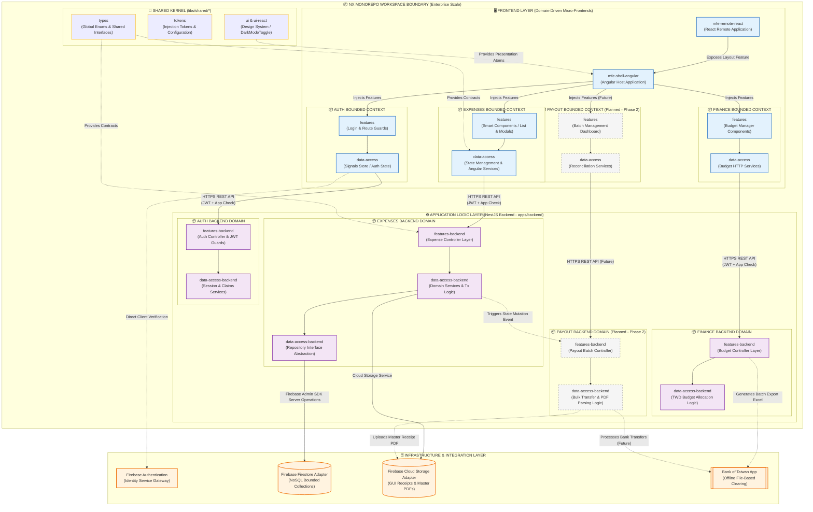
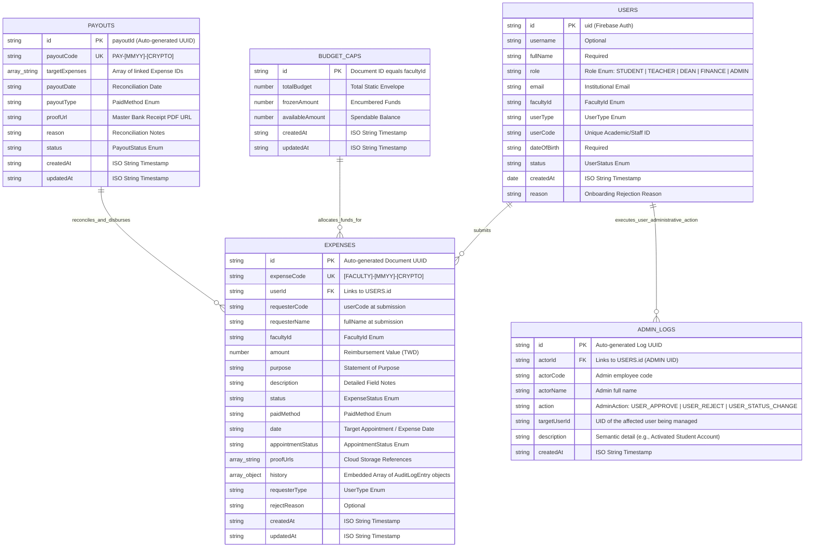

```mermaid

flowchart TD
%% Define Pure Business Logic Styles
classDef action fill:#ffffff,stroke:#37474f,stroke-width:1.5px;
classDef state fill:#fff3e0,stroke:#ef6c00,stroke-width:2px,stroke-dasharray: 4 4;
classDef condition fill:#eceff1,stroke:#455a64,stroke-width:1.5px;
classDef success fill:#e8f5e9,stroke:#2e7d32,stroke-width:2px;
classDef log fill:#e0f7fa,stroke:#00838f,stroke-width:1.5px;

%% Pre-define Centralized State Node to avoid parser conflicts
ST_Rejected((State:<br/>REJECTED))

subgraph Expense_Module ["📑 EXPENSE MODULE (Document & Approval Lifecycle)"]
    Start([🚀 Start: User Submits Request]) --> Act_Input
    Act_Input["Input Details & Uniform Invoice No. GUI"] --> Decision_Format
    Decision_Format{"Validation:<br/>Valid GUI Format?"}
    
    Decision_Format -->|"No"| Act_FixForm
    Act_FixForm["Prompt Error to Correct"] --> Act_Input
    
    Decision_Format -->|"Yes"| Log_Create
    Log_Create["Create AuditLogEntry<br/>action: SUBMIT"] --> Decision_Role
    
    Decision_Role{"Evaluate Submitter Role<br/>via JWT Custom Claims"}
    
    %% Branch 1: Student takes the full path
    ST_PendingTeacher(("State:<br/>PENDING_TEACHER_REVIEW"))
    Decision_Role -->|"Role: STUDENT"| ST_PendingTeacher
    
    ST_PendingTeacher --> Decision_Teacher
    Decision_Teacher{"Staff Review:<br/>Filter by departmentId"}
    
    Decision_Teacher -->|"Reject"| Log_StaffReject
    Log_StaffReject["Create AuditLogEntry<br/>action: REJECT & capture rejectReason"] --> Act_SetStaffReject
    Act_SetStaffReject["System: Set ExpenseStatus to REJECTED"] --> ST_Rejected
    
    %% Branch 2: Teacher / Staff bypasses Teacher Review
    ST_PendingDean(("State:<br/>PENDING_DEAN_APPROVAL"))
    Decision_Role -->|"Role: TEACHER / STAFF"| ST_PendingDean
    Decision_Teacher -->|"Approve"| Log_StaffApprove
    Log_StaffApprove["Create AuditLogEntry<br/>action: APPROVE"] -->|"Push to history"| ST_PendingDean
    
    ST_PendingDean --> Decision_Dean
    Decision_Dean{"Dean Review:<br/>Check Faculty Budget Cap in TWD"}
    
    Decision_Dean -->|"Reject"| Log_DeanReject
    Log_DeanReject["Create AuditLogEntry<br/>action: REJECT & capture rejectReason"] --> Act_SetDeanReject
    Act_SetDeanReject["System: Set ExpenseStatus to REJECTED"] --> ST_Rejected
    
    %% Branch 3: Dean bypasses manual reviews but system forces immediate budget freeze
    ST_PendingFinanceApproval(("State:<br/>PENDING_FINANCE_APPROVAL"))
    Decision_Role -->|"Role: DEAN"| Act_Freeze
    Decision_Dean -->|"Approve"| Act_Freeze
    
    Act_Freeze["DB Transaction:<br/>Freeze Requested TWD Amount"] --> Log_DeanApprove
    Log_DeanApprove["Create AuditLogEntry<br/>action: APPROVE & Budget Frozen"] -->|"Push to history"| ST_PendingFinanceApproval
    
    %% Unified Finance Audit Stage
    ST_PendingFinanceApproval --> Decision_Finance
    Decision_Finance{"Finance Audit:<br/>Verify School Tax ID 04126516?"}
    
    Decision_Finance -->|"Invalid"| Log_FinReject
    Log_FinReject["Create AuditLogEntry<br/>action: REJECT & capture rejectReason"] --> Act_SetFinReject
    Act_SetFinReject["System: Set ExpenseStatus to REJECTED"] --> Act_FinUnfreeze
    Act_FinUnfreeze["DB Transaction: Unfreeze TWD Balance"] --> ST_Rejected
    
    Decision_Finance -->|"Valid"| Log_FinApprove
    Log_FinApprove["Create AuditLogEntry<br/>action: APPROVE ➔ Ready for Payout"] --> Act_ReadyForPayout
    Act_ReadyForPayout["Lock Document Data & Queue for Payout"]
end

subgraph Payout_Module ["🏦 PAYOUT MODULE (Manual Reconciliation & Execution)"]
    ST_PendingDisbursement(("State:<br/>PENDING_DISBURSEMENT"))
    Act_ReadyForPayout -->|"System Sync: Set Status to PENDING_DISBURSEMENT"| ST_PendingDisbursement
    
    ST_PendingDisbursement --> Decision_PayoutMethod
    Decision_PayoutMethod{"Finance Officer Action:<br/>Select Strategy PaidMethod"}
    
    %% ==========================================
    %% AUTOMATED CASH PROCESSING WITH CRON JOB
    %% ==========================================
    Decision_PayoutMethod -->|"PaidMethod.CASH"| Act_CheckSlot
    Act_CheckSlot["Student opens UI Modal:<br/>Fetches available dates from payout-slots"] --> Decision_Quota
    
    Decision_Quota{"Is Selected Date<br/>Quota < 100?"}
    Decision_Quota -->|"No: Slot Full"| Act_CheckSlot
    
    Decision_Quota -->|"Yes: Slot Available"| Act_BookSlot
    Act_BookSlot["DB Transaction:<br/>Increment currentCount & Bind date to Expense"] --> Act_WaitDay
    
    Act_WaitDay["Wait for Scheduled Appointment Date"] --> Decision_Attendance
    Decision_Attendance{"Lifecycle Event Audit:<br/>Trigger Condition Type?"}
    
    %% AUTOMATED RESET LOOP VIA MIDNIGHT CRON JOB
    Decision_Attendance -->|"Midnight Cron: Past & Unpaid"| Act_CronReset
    Act_CronReset["Automated Midnight Cron Job:<br/>Reset appointmentStatus to MISSED & Unlock User"] --> Act_CheckSlot
    
    %% Process if student arrived within the day
    Decision_Attendance -->|"Manual: Student Present Within Slot"| Act_VerifyPaper
    Act_VerifyPaper["Verify Original Physical GUI Invoice"] --> Act_StampPaper
    Act_StampPaper["Stamp '已核銷 - PAID' on Physical Bill"] --> Act_UploadCashProof
    
    Act_UploadCashProof["Upload Photo of Stamped Invoice to proofUrls"] --> Act_ManualCashPaid
    Act_ManualCashPaid["Click 'Confirm Cash Paid' on Payout Page"] --> Log_CashPaid
    Log_CashPaid["Create AuditLogEntry<br/>action: DISBURSE"] --> Act_SyncDisbursed
    
    %% ==========================================
    %% BRANCH: BANK TRANSFER PROCESSING (WITH FAILURE PROOF UPLOADS)
    %% ==========================================
    Decision_PayoutMethod -->|"PaidMethod.BANK_TRANSFER"| Act_CreateBatch
    Act_CreateBatch["Select Multiple Requests ➔ Create Batch Record"] --> Act_ExportBank
    Act_ExportBank["Export Batch File & Manually Upload to Bank Portal"] --> Log_BatchExport
    Log_BatchExport["Log: Batch Exported with linked expenseIds"] --> Act_ReviewOffline
    Act_ReviewOffline["Finance Officer: Reviews Offline Bank Report"] --> Decision_ManualRecon
    
    Decision_ManualRecon{"Manual Reconciliation View:<br/>Finance Officer Updates Status"}
    
    %% Scenario 1: All Successful
    Decision_ManualRecon -->|"All Successful"| Act_UploadMasterReceipt
    Act_UploadMasterReceipt["Upload Master Bank Receipt PDF to Batch proofUrls"] --> Act_MarkBatchPaid
    Act_MarkBatchPaid["Click 'Mark Batch as Paid'"] --> Log_BatchSuccess
    Log_BatchSuccess["Create AuditLogEntry for All Items<br/>action: DISBURSE & Inherit Receipt"] --> Act_SyncDisbursed
    
    %% Scenario 2: Total Failure
    Decision_ManualRecon -->|"Total Failure"| Act_UploadTotalFailProof
    Act_UploadTotalFailProof["Upload Bank Failure Report/Error Statement to Batch proofUrls"] --> Act_RejectBatch
    Act_RejectBatch["Click 'Reject Batch'"] --> Log_BatchFail
    Log_BatchFail["Log: Batch Canceled & Capture rejectReason"] --> Act_SyncAllRejected
    Act_SyncAllRejected["System Sync: Set ExpenseStatus to REJECTED<br/>➔ Append final AuditLogEntry with rejectReason to history"] --> Act_BatchUnfreeze
    Act_BatchUnfreeze["DB Transaction: Unfreeze TWD Balance for All Items"] --> ST_Rejected
    
    %% Scenario 3: Partial Failure
    Decision_ManualRecon -->|"Partial Failure"| Act_UploadPartialFailProof
    Act_UploadPartialFailProof["Upload Bank Statement detailing failed line-items to Batch proofUrls"] --> Act_LineAudit
    Act_LineAudit["Isolate Failed Requests on Payout View"] --> Act_MarkFailedItems
    
    Act_MarkFailedItems["Click 'Mark Selected as Failed'"] --> Log_LineFail
    Log_LineFail["Create AuditLogEntry for Lines<br/>action: REJECT & capture rejectReason"] --> Act_SyncLineRejected
    Act_SyncLineRejected["System Sync: Set Failed Line-Items Status to REJECTED<br/>➔ Append final AuditLogEntry with rejectReason to history"] --> Act_LineUnfreeze
    Act_LineUnfreeze["DB Transaction: Unfreeze TWD Balance for Failed Lines"] --> ST_Rejected
    
    %% Partial Failure Branch - Success Items Line Logic
    Act_LineAudit --> Act_UploadPartialReceipt
    Act_UploadPartialReceipt["Upload Master Bank Receipt PDF for Successful Part"] --> Act_MarkSuccessItems
    Act_MarkSuccessItems["Click 'Mark Remaining as Paid'"] --> Log_LineSuccess
    Log_LineSuccess["Create AuditLogEntry for Lines<br/>action: DISBURSE & Inherit Receipt"] --> Act_SyncDisbursed
end

%% Cross-Module State Sync Hooks
ST_Disbursed(("State:<br/>DISBURSED"))
End_Success([🏁 End: Expense Closed])
Act_SyncDisbursed["System Sync: Set ExpenseStatus to DISBURSED<br/>➔ Append final AuditLogEntry to history"] --> ST_Disbursed --> End_Success

%% Linear mapping to prevent Mermaid Array Length limits
Act_SetStaffReject --> ST_Rejected
Act_SetDeanReject --> ST_Rejected
Act_FinUnfreeze --> ST_Rejected
Act_BatchUnfreeze --> ST_Rejected
Act_LineUnfreeze --> ST_Rejected

Act_Clone["UX Rule: Student Clones Request to Fix Details<br/>➔ Copy Text Metadata & Purge old proofUrls"]
ST_Rejected --> Act_Clone --> Start

%% Apply Styling Classes
class Act_Input,Act_FixForm,Act_Freeze,Act_SetStaffReject,Act_SetDeanReject,Act_SetFinReject,Act_FinUnfreeze,Act_ReadyForPayout,Act_CheckSlot,Act_BookSlot,Act_WaitDay,Act_CronReset,Act_VerifyPaper,Act_StampPaper,Act_UploadCashProof,Act_ManualCashPaid,Act_CreateBatch,Act_ExportBank,Act_ReviewOffline,Act_UploadMasterReceipt,Act_MarkBatchPaid,Act_UploadTotalFailProof,Act_RejectBatch,Act_SyncAllRejected,Act_BatchUnfreeze,Act_UploadPartialFailProof,Act_LineAudit,Act_MarkFailedItems,Act_SyncLineRejected,Act_LineUnfreeze,Act_UploadPartialReceipt,Act_MarkSuccessItems,Act_SyncDisbursed,Act_Clone action;
class ST_PendingTeacher,ST_PendingDean,ST_PendingFinanceApproval,ST_PendingDisbursement,ST_Rejected,ST_Disbursed state;
class Decision_Format,Decision_Role,Decision_Teacher,Decision_Dean,Decision_Finance,Decision_PayoutMethod,Decision_Quota,Decision_Attendance,Decision_ManualRecon condition;
class End_Success success;
class Log_Create,Log_StaffReject,Log_StaffApprove,Log_DeanReject,Log_DeanApprove,Log_FinReject,Log_FinApprove,Log_CashPaid,Log_BatchExport,Log_BatchSuccess,Log_BatchFail,Log_LineFail,Log_LineSuccess log;
```

```mermaid
graph TD
    %% Style Definitions
    classDef phase1 fill:#f5f5f5,stroke:#9e9e9e,stroke-width:1.5px,stroke-dasharray: 4 4;
    classDef phase2 fill:#e3f2fd,stroke:#1565c0,stroke-width:1.5px;
    classDef phase3 fill:#e8f5e9,stroke:#2e7d32,stroke-width:2px;
    classDef phase4 fill:#fff8e1,stroke:#ffb300,stroke-width:1.5px;

    %% Phases
    subgraph P1 ["🌱 PHASE 1: CLIENT-SIDE MONOLITH (13 Oct 2024 - May 27, 2025)"]
        M1["- Developed purely on Frontend using Angular 18<br/>- Utilized direct client-to-database integration with Firebase<br/>- Implemented basic personal Expense CRUD and native Firebase Auth"]
    end

    subgraph P2 ["🔧 PHASE 2: WORKSPACE OVERHAUL & MODERNIZATION (Jul 5, 2025 - Jun 5, 2026)"]
        M2["- Migrated codebase to an Nx Monorepo workspace ('micro-expense-tracker-personal')<br/>- Added NestJS backend layer operating on a hybrid MongoDB + Firebase infrastructure<br/>- Fabricated core UI elements and integrated initial React-wrapped SVG Chart components<br/>- <b>Late-Phase Architectural Shifts:</b> Dropped MongoDB; upgraded to Angular 22; shifted RxJS to native Signals; built Abstraction Layers"]
    end

    subgraph P3 ["🎯 PHASE 3: INSTITUTIONAL ECOSYSTEM PIVOT (Jun 6, 2026 - Present)"]
        M3["- Spawned current 'school-expense-ecosystem' repo; refactored scope to University Budget Management<br/>- Enforced Monorepo boundaries using explicit Nx Dependency Tags (project.json)<br/>- Hardened full-stack security via JWT Custom Claims, NestJS Throttling, and Firebase App Check<br/>- Fully deprecated Akita state management in favor of native Angular Signals Store<br/>- Engineered multi-role workflows, onboarding/rejection pipelines, and Admin user provisioning<br/>- <i>Isolated the decoupled Report charts for downstream synchronization</i>"]
    end

    subgraph P4 ["🚀 PHASE 4: ENTERPRISE HARDENING, LOCALIZATION & QA (Planned / Future Backlog)"]
        M4["- <b>1. Expense Specification Alignment:</b> Refine core validation to intercept duplicate tax invoices and verify vendor compliance data<br/>- <b>2. Downstream Report Refactoring:</b> Re-engineer Report Chart bindings to seamlessly consume finalized institutional Expense schemas<br/>- <b>3. Budget Ledger & Payout Realization:</b> Code transactional ledger workflows and state machines to manage atomic balance freezing and bulk bank reconciliations<br/>- <b>4. Cash Payout Appointment Scheduling:</b> Build capacity-controlled slot booking components and background Midnight Cron Jobs to release expired slots<br/>- <b>5. Cross-Border Internationalization & Localization (i18n):</b> Integrate Angular i18n / Transloco to support Traditional Chinese (zh-TW) and localize currency formats (TWD) for Taiwanese academic standards<br/>- <b>6. Automated Testing Suite:</b> Write Jest unit/integration tests for NestJS controllers and Cypress E2E test scripts for multi-role workflows"]
    end

    %% Flow Links
    M1 -->|Complete Engineering Re-write| M2
    M2 -->|Domain Scope Expansion| M3
    M3 -->|System Hardening Pipeline| M4

    %% Apply Styles
    class M1 phase1;
    class M2 phase2;
    class M3 phase3;
    class M4 phase4;
```

### 📑 Core Modules Flowcharts

<b>1.User Management Business Logic Flowchart (Click to expand)</b>

  

<b>2.Business Logic Flowchart for Expense Management & Payout Lifecycle  (Click to expand)</b>

  

<b>3. High-level Architectural Block Diagram (Click to expand)</b>

  

<b>4. Firestore NoSQL Data Model Diagram (Click to expand)</b>

  

  
<b>5. Technical Project Roadmap (Click to expand)</b>

  

