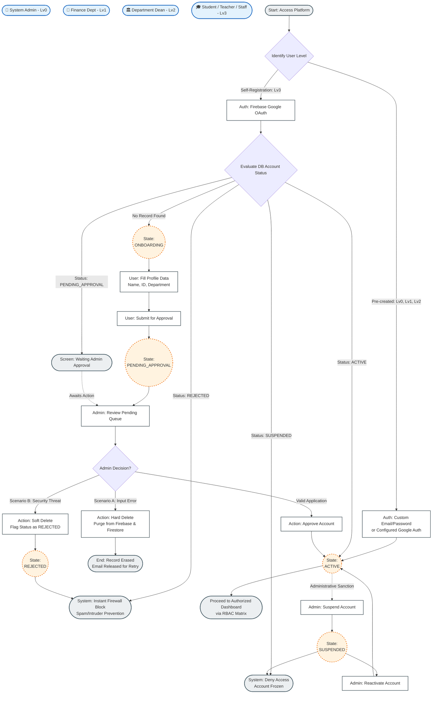

```mermaid
graph TB
    %% Define DDD Architecture Styles
    classDef client fill:#e3f2fd,stroke:#1565c0,stroke-width:1.5px;
    classDef backend fill:#f3e5f5,stroke:#7b1fa2,stroke-width:1.5px;
    classDef shared fill:#fffde7,stroke:#fbc02d,stroke-width:1.5px;
    classDef infra fill:#fff3e0,stroke:#ef6c00,stroke-width:2px;
    classDef data_abstraction fill:#e0f2f1,stroke:#004d40,stroke-width:2.5px;
    classDef planned fill:#f5f5f5,stroke:#9e9e9e,stroke-width:1.5px,stroke-dasharray: 5 5;
    classDef highlight fill:#e8f5e9,stroke:#2e7d32,stroke-width:2px;

    subgraph Workspace_Monorepo ["📦 NX MONOREPO WORKSPACE (Enterprise Domain-Driven Design)"]

        %% ========================================================
        %% FRONTEND CONTEXTS LAYER
        %% ========================================================
        subgraph FE_Layer ["🖥️ FRONTEND LAYER (Domain-Driven Micro-Frontends)"]
            App_Shell["mfe-shell-angular<br/>(Angular Host Application)"]
            App_Remote["mfe-remote-react<br/>(React Remote Application)"]

            %% Context: Projects & Events
            subgraph Projects_FE ["📦 PROJECTS & EVENTS CONTEXT (libs/projects/*)"]
                FE_Proj_Feature["features<br/>• CreateProjectDialog<br/>• CreateEventDialog<br/>• JoinCodeDialog / Manage"]
                FE_Proj_DA["data-access<br/>(ProjectApiService & EventApiService)"]
                FE_Proj_UI["ui & utils<br/>(ActivityCapacityProgress & Layouts)"]
            end

            %% Context: Expenses
            subgraph Expense_FE ["📦 EXPENSES CONTEXT (libs/expenses/*)"]
                FE_Exp_Feature["features<br/>• CreateExpenseModal (Item List & Est TWD)<br/>• InvoiceSettlementModal (e-GUI Scan)<br/>• ExpenseReviewModal (Teacher/Dean/Fin)"]
                FE_Exp_DA["data-access<br/>(ExpenseService & ExpenseSignalStore)"]
            end

            %% Context: Finance
            subgraph Finance_FE ["📦 FINANCE CONTEXT (libs/finance/*)"]
                FE_Fin_Feature["features<br/>(BudgetManager / Ledger Overview)"]
                FE_Fin_DA["data-access<br/>(BudgetApiService)"]
            end

            %% Context: Auth
            subgraph Auth_FE ["📦 AUTH CONTEXT (libs/auth/*)"]
                FE_Auth_Feature["features<br/>(Login, RegisterModal, Onboarding)"]
                FE_Auth_DA["data-access<br/>(AuthSignalStore & ActiveUserGuard)"]
            end

            %% Context: Payout (Phase 2)
            subgraph Payout_FE ["📦 PAYOUT CONTEXT (Planned - Phase 2)"]
                FE_Pay_Feature["features<br/>(Batch Wire & Counter Cash Dashboard)"]
                FE_Pay_DA["data-access<br/>(ReconciliationService)"]
            end
        end

        %% ========================================================
        %% BACKEND CONTEXTS LAYER
        %% ========================================================
        subgraph BE_Layer ["⚙️ APPLICATION LOGIC LAYER (NestJS Core - apps/backend)"]

            %% Backend: Projects & Events
            subgraph Projects_BE ["📦 PROJECTS & EVENTS DOMAIN (libs/projects/*)"]
                BE_Proj_Ctrl["features-backend<br/>(ProjectController & EventController)"]
                BE_Proj_Service["data-access-backend<br/>(ProjectService, EventService & SharedService)"]
                BE_Proj_Guard["guards-backend<br/>(ActivityMembershipGuard & CapGuard)"]
                BE_Proj_Repo["data-access-backend<br/>[DATA ABSTRACTION LAYER:<br/>ProjectRepo & EventRepo Contracts]"]
            end

            %% Backend: Expenses
            subgraph Expense_BE ["📦 EXPENSES DOMAIN (libs/expenses/*)"]
                BE_Exp_Ctrl["features-backend<br/>(ExpenseController)"]
                BE_Exp_Service["data-access-backend<br/>(Two-Phase Reservation & Variance Logic)"]
                BE_Exp_Guard["guards-backend<br/>(ExpenseReviewGuard & CapGuard)"]
                BE_Exp_Repo["data-access-backend<br/>[DATA ABSTRACTION LAYER:<br/>ExpenseRepository Contract]"]
            end

            %% Backend: Finance
            subgraph Finance_BE ["📦 FINANCE DOMAIN (libs/finance/*)"]
                BE_Fin_Ctrl["features-backend<br/>(BudgetController & FacultyController)"]
                BE_Fin_Service["data-access-backend<br/>(School Treasury & Ledger Service)"]
                BE_Fin_Repo["data-access-backend<br/>[DATA ABSTRACTION LAYER:<br/>Faculty & BudgetRepo Contract]"]
            end

            %% Backend: Auth
            subgraph Auth_BE ["📦 AUTH DOMAIN (libs/auth/*)"]
                BE_Auth_Ctrl["features-backend<br/>(AuthController & RolesGuard)"]
                BE_Auth_Service["data-access-backend<br/>(Session & Token Claims Service)"]
                BE_Auth_Repo["data-access-backend<br/>[DATA ABSTRACTION LAYER:<br/>Identity & UserRepo Contract]"]
            end

            %% Backend: Payout (Phase 2)
            subgraph Payout_BE ["📦 PAYOUT DOMAIN (Planned - Phase 2)"]
                BE_Pay_Ctrl["features-backend<br/>(PayoutBatchController)"]
                BE_Pay_Service["data-access-backend<br/>(AtomicSlotBooking & BankRecon)"]
                BE_Pay_Repo["data-access-backend<br/>[DATA ABSTRACTION LAYER:<br/>PayoutStorage Contract]"]
            end
        end

        %% ========================================================
        %% SHARED KERNEL
        %% ========================================================
        subgraph Shared_Kernel ["💛 SHARED KERNEL (libs/shared/*)"]
            Shared_Types["types<br/>(ProjectStatus, EventStatus, FundingType,<br/>UserType, Role, ExpenseStatus)"]
            Shared_Tokens["tokens<br/>(InjectionTokens & AppConfigs)"]
            Shared_UI["ui & ui-react<br/>(Shared Modal, Breadcrumb, DarkMode)"]
            Shared_Guards["guards-backend<br/>(JwtAuthGuard, RolesDecorator, AppCheckGuard)"]
        end
    end

    %% ========================================================
    %% INFRASTRUCTURE ADAPTERS LAYER
    %% ========================================================
    subgraph Infrastructure ["🗄️ INFRASTRUCTURE ADAPTERS LAYER (Storage & External Systems)"]
        FB_Auth["Firebase Authentication<br/>(Identity Service Gateway)"]
        Firestore[("Cloud Firestore<br/>• projects & events<br/>• expenses (items, est, actual)<br/>• budgets & invoices_registry")]
        Storage[("Cloud Storage Bucket<br/>(e-GUI Invoices & Stamped Cash Proofs)")]
        BankBOT[["Bank of Taiwan Portal<br/>(Offline File-Based Clearing)"]]
    end

    %% ========================================================
    %% COMPONENT LINKAGES & DATA FLOWS
    %% ========================================================

    %% Frontend Integrations
    App_Shell --> FE_Proj_Feature
    App_Shell --> FE_Exp_Feature
    App_Shell --> FE_Fin_Feature
    App_Shell --> FE_Auth_Feature
    App_Shell -.-> FE_Pay_Feature
    App_Remote -->|"Exposes Header/Theme Layout"| App_Shell

    FE_Proj_Feature --> FE_Proj_DA
    FE_Proj_Feature --> FE_Proj_UI
    FE_Exp_Feature --> FE_Exp_DA
    FE_Exp_Feature -.->|"Query User Active Memberships"| FE_Proj_DA
    FE_Fin_Feature --> FE_Fin_DA
    FE_Auth_Feature --> FE_Auth_DA
    FE_Pay_Feature --> FE_Pay_DA

    %% Frontend to Backend (REST APIs)
    FE_Proj_DA -->|"HTTPS / REST (JWT + AppCheck)"| BE_Proj_Ctrl
    FE_Exp_DA -->|"HTTPS / REST (JWT + AppCheck)"| BE_Exp_Ctrl
    FE_Fin_DA -->|"HTTPS / REST (JWT + AppCheck)"| BE_Fin_Ctrl
    FE_Auth_DA -->|"HTTPS / REST (JWT + AppCheck)"| BE_Auth_Ctrl
    FE_Pay_DA -.->|"HTTPS / REST (Future)"| BE_Pay_Ctrl

    %% Backend Controller to Service
    BE_Proj_Ctrl --> BE_Proj_Guard --> BE_Proj_Service
    BE_Exp_Ctrl --> BE_Exp_Guard --> BE_Exp_Service
    BE_Fin_Ctrl --> BE_Fin_Service
    BE_Auth_Ctrl --> BE_Auth_Service
    BE_Pay_Ctrl --> BE_Pay_Service

    %% Cross-Domain Domain Service Orchestration (Business Logic)
    BE_Proj_Service -->|"SCHOOL Funding: Request Budget Alloc"| BE_Fin_Service
    BE_Exp_Service -->|"Phase 1: Hold Estimated Cap"| BE_Proj_Service
    BE_Exp_Service -->|"Phase 2: Settle & Unfreeze Delta"| BE_Proj_Service
    BE_Exp_Service -.->|"Queue Ready for Payout"| BE_Pay_Service

    %% Service to Repository Contract (Data Abstraction)
    BE_Proj_Service --> BE_Proj_Repo
    BE_Exp_Service --> BE_Exp_Repo
    BE_Fin_Service --> BE_Fin_Repo
    BE_Auth_Service --> BE_Auth_Repo
    BE_Pay_Service --> BE_Pay_Repo

    %% Repository Contracts to Infrastructure
    BE_Proj_Repo --> Firestore
    BE_Exp_Repo --> Firestore
    BE_Exp_Repo --> Storage
    BE_Fin_Repo --> Firestore
    BE_Auth_Repo --> FB_Auth
    BE_Auth_Repo --> Firestore
    BE_Pay_Repo --> Firestore
    BE_Pay_Repo --> Storage

    %% Shared Types Distribution
    Shared_Types -.-> BE_Proj_Ctrl
    Shared_Types -.-> BE_Exp_Ctrl
    Shared_Types -.-> FE_Proj_DA
    Shared_Types -.-> FE_Exp_DA

    %% External Systems
    BE_Fin_Ctrl -.->|"Generate Batch Export"| BankBOT
    BE_Pay_Service -.->|"Reconcile Transfer Statement"| BankBOT

    %% Class Assignments
    class App_Shell,App_Remote,FE_Proj_Feature,FE_Proj_DA,FE_Proj_UI,FE_Exp_Feature,FE_Exp_DA,FE_Fin_Feature,FE_Fin_DA,FE_Auth_Feature,FE_Auth_DA client;
    class BE_Proj_Ctrl,BE_Proj_Service,BE_Proj_Guard,BE_Exp_Ctrl,BE_Exp_Service,BE_Exp_Guard,BE_Fin_Ctrl,BE_Fin_Service,BE_Auth_Ctrl,BE_Auth_Service backend;
    class Shared_Types,Shared_Tokens,Shared_UI,Shared_Guards shared;
    class FB_Auth,Firestore,Storage,BankBOT infra;
    class BE_Proj_Repo,BE_Exp_Repo,BE_Fin_Repo,BE_Auth_Repo data_abstraction;
    class FE_Pay_Feature,FE_Pay_DA,BE_Pay_Ctrl,BE_Pay_Service,BE_Pay_Repo planned;
    class Projects_FE,Projects_BE highlight;
```

```mermaid
erDiagram
    %% ========================================================
    %% IDENTITY & MEMBERSHIP MANAGEMENT
    %% ========================================================
    USERS {
        string id PK "uid (Firebase Auth)"
        string userCode UK "Unique Academic/Staff ID"
        string fullName "Legal Name"
        string email "Institutional Email"
        string role "Role: ADMIN | FINANCE_OFFICER | FACULTY_DEAN | END_USER"
        string userType "UserType: STUDENT | TEACHER | STAFF"
        string facultyId "FacultyId: FIT | FBE | FLL | FET | FAD | FLA"
        string status "UserStatus: PENDING | ACTIVE | REJECTED | SUSPENDED"
        string createdAt "ISO String"
    }

    ACTIVITY_MEMBERS {
        string id PK "Auto-generated UUID"
        string activityType "Type: PROJECT | EVENT"
        string activityId FK "Links to PROJECTS.id or EVENTS.id"
        string userId FK "Links to USERS.id"
        string roleInActivity "ActivityRole: LEADER | ADVISOR_TEACHER | MEMBER"
        string joinCodeId FK "Nullable: Links to JOIN_CODES.id"
        string joinedAt "ISO String"
    }

    JOIN_CODES {
        string id PK "Auto-generated UUID"
        string code UK "Alphanumeric Code"
        string activityType "Type: PROJECT | EVENT"
        string activityId FK "Links to PROJECTS.id or EVENTS.id"
        string createdById FK "Links to USERS.id"
        number maxQuota "Capacity Limit"
        number currentCount "Current Registrations"
        string status "JoinCodeStatus: SCHEDULED | ACTIVE | FULL | EXPIRED"
        string validFrom "ISO String"
        string validUntil "ISO String"
    }

    %% ========================================================
    %% PROJECT & EVENT ENTITIES
    %% ========================================================
    PROJECTS {
        string id PK "Auto-generated UUID"
        string projectCode UK "PRJ-[FACULTY]-[YY]-[CRYPTO]"
        string title "Project Display Name"
        string ownerId FK "Creator (USERS.id)"
        string facultyId "FacultyId Enum"
        string fundingType "ProjectFundingType: SCHOOL | FACULTY | OUTSOURCE"
        string status "ProjectStatus: DRAFT | PENDING_DEAN_APPROVAL | PENDING_FINANCE_APPROVAL | ACTIVE | COMPLETED | REJECTED"
        number totalBudget "TWD Total Allocated Budget"
        number holdBalance "TWD Reserved For In-Flight Procurements"
        number spentBalance "TWD Realized / Settled Expenditures"
        number availableBalance "totalBudget - holdBalance - spentBalance"
        string createdAt "ISO String"
        string updatedAt "ISO String"
    }

    EVENTS {
        string id PK "Auto-generated UUID"
        string eventCode UK "EVT-[FACULTY]-[YY]-[CRYPTO]"
        string title "Event Display Name"
        string organizerId FK "Creator (USERS.id)"
        string projectId FK "Nullable: Parent Project (if fundingType = PROJECT)"
        string facultyId "FacultyId Enum"
        string fundingType "EventFundingType: SCHOOL | FACULTY | OUTSOURCE | PROJECT"
        string status "EventStatus: PENDING_DEAN_APPROVAL | PENDING_FINANCE_APPROVAL | UPCOMING | ONGOING | COMPLETED | REJECTED"
        number totalBudget "TWD Event Budget Cap"
        number holdBalance "TWD Reserved For In-Flight Procurements"
        number spentBalance "TWD Realized Expenditures"
        number availableBalance "Spendable Balance"
        string createdAt "ISO String"
        string updatedAt "ISO String"
    }

    %% ========================================================
    %% 2-PHASE EXPENSE & PROCUREMENT MANAGEMENT
    %% ========================================================
    EXPENSES {
        string id PK "Auto-generated UUID"
        string expenseCode UK "EXP-[FACULTY]-[MMYY]-[CRYPTO]"
        string requesterId FK "Applicant (USERS.id - Must be Activity Member)"
        string activityType "Scope: PROJECT | EVENT"
        string activityId FK "Links to PROJECTS.id or EVENTS.id"
        string advisorTeacherId FK "Nullable: Supervising Teacher (USERS.id)"
        string status "ExpenseStatus: DRAFT | PENDING_TEACHER_REVIEW | PENDING_DEAN_APPROVAL | AUTHORIZED_FOR_PURCHASE | PENDING_FINANCE_APPROVAL | PENDING_DISBURSEMENT | DISBURSED | REVISION_REQUIRED | REJECTED"
        number totalEstimatedAmount "Sum of procurement items (Phase 1)"
        number totalActualAmount "Nullable: Sum of actual receipts (Phase 2)"
        number varianceAmount "totalActualAmount - totalEstimatedAmount"
        string purpose "Procurement Business Rationale"
        string paidMethod "PaidMethod: CASH | BANK_TRANSFER"
        string cashAppointmentDate "Scheduled Counter Appointment Date"
        string payoutBatchId FK "Nullable: Links to PAYOUT_BATCHES.id"
        array_string receiptProofUrls "Taiwan GUI Scan or Stamped Paper Proofs"
        string rejectReason "Optional audit decline notes"
        string createdAt "ISO String"
        string updatedAt "ISO String"
    }

    PROCUREMENT_ITEMS {
        string id PK "Auto-generated Item UUID"
        string expenseId FK "Links to EXPENSES.id"
        string itemName "Descriptive Item Name / Specs"
        number quantity "Planned Purchase Units"
        number estimatedUnitPrice "Estimated Unit Price (TWD)"
        number estimatedSubtotal "quantity * estimatedUnitPrice"
        string purposeNote "Why this item is necessary"
        number actualUnitPrice "Nullable: Actual Unit Price (TWD)"
        number actualSubtotal "Nullable: actualUnitPrice * quantity"
    }

    INVOICE_REGISTRY {
        string id PK "Auto-generated UUID"
        string invoiceNumber UK "e-GUI 10-char alphanumeric (e.g. AB-12345678)"
        string invoiceDate UK "GUI Issuance Date (Compound unique key)"
        string buyerTaxId "Must match School VAT: 04126516"
        number totalAmount "Decoded Amount from Hex (TWD)"
        string expenseId FK "Enforces 1:1 binding to EXPENSES.id"
        string uploadedById FK "Links to USERS.id"
        string rawQrLeft "Raw decoded 77-byte standard QR string"
        string rawQrRight "Raw decoded auxiliary QR string"
        string createdAt "ISO String"
    }

    EXPENSE_AUDIT_LOGS {
        string id PK "Auto-generated Log UUID"
        string expenseId FK "Links to EXPENSES.id"
        string actorId FK "Actor (USERS.id)"
        string actorRole "Actor Role at execution"
        string action "AuditAction: DRAFT_SUBMIT | TEACHER_REVIEW | DEAN_APPROVE | RECEIPT_UPLOAD | FINANCE_APPROVE | REJECT | DISBURSE"
        string previousStatus "ExpenseStatus Enum"
        string newStatus "ExpenseStatus Enum"
        string comments "Audit findings / variance explanations"
        string createdAt "ISO String"
    }

    %% ========================================================
    %% TREASURY & PAYOUT DISBURSEMENT
    %% ========================================================
    FACULTY_BUDGETS {
        string id PK "Document ID equals facultyId or SCHOOL_TREASURY"
        string facultyId "FacultyId: FIT | FBE | FLL | FET | FAD | FLA"
        number totalAllocation "School Allocated Annual Budget"
        number allocatedToProjects "Portion committed to Projects"
        number spentAmount "Actual Disbursed to date"
        number availableBalance "Unallocated Faculty Reserve"
        string fiscalYear "e.g. 2026-2027"
        string updatedAt "ISO String"
    }

    PAYOUT_BATCHES {
        string id PK "Auto-generated Batch UUID"
        string batchCode UK "BATCH-[YYMMDD]-[CRYPTO]"
        string payoutType "PaidMethod: BANK_TRANSFER | CASH_DESK"
        number totalDisbursedAmount "Cumulative sum of linked expenses"
        number itemCount "Total number of settled expense requests"
        string masterProofUrl "Bank Wire Reconciliation PDF"
        string status "BatchStatus: CREATED | EXPORTED | RECONCILED | REJECTED"
        string createdAt "ISO String"
        string updatedAt "ISO String"
    }

    %% ========================================================
    %% DOMAIN RELATIONSHIPS
    %% ========================================================
    USERS ||--o{ PROJECTS : "creates_or_owns"
    USERS ||--o{ EVENTS : "organizes"
    USERS ||--o{ ACTIVITY_MEMBERS : "participates_as"
    USERS ||--o{ EXPENSES : "submits_procurement"
    USERS ||--o{ EXPENSE_AUDIT_LOGS : "records_action"

    PROJECTS ||--o{ ACTIVITY_MEMBERS : "enrolls"
    EVENTS ||--o{ ACTIVITY_MEMBERS : "enrolls"
    PROJECTS ||--o{ JOIN_CODES : "generates_access_code"
    EVENTS ||--o{ JOIN_CODES : "generates_access_code"
    JOIN_CODES ||--o{ ACTIVITY_MEMBERS : "redeemed_by"

    PROJECTS ||--o{ EVENTS : "funds_child_event"
    FACULTY_BUDGETS ||--o{ PROJECTS : "allocates_budget_cap"

    PROJECTS ||--o{ EXPENSES : "funds_expense_request"
    EVENTS ||--o{ EXPENSES : "funds_expense_request"
    EXPENSES ||--|{ PROCUREMENT_ITEMS : "contains_line_items"
    EXPENSES ||--o| INVOICE_REGISTRY : "verified_by_e_invoice"
    EXPENSES ||--o{ EXPENSE_AUDIT_LOGS : "tracks_audit_trail"
    
    PAYOUT_BATCHES ||--o{ EXPENSES : "settles_and_disburses"
```

### 📑 Core Modules Flowcharts

<b>1.User Management Business Logic Flowchart (Click to expand)</b>

  

<b>2.Business Logic Flowchart for Expense Management & Payout Lifecycle  (Click to expand)</b>

  

<b>3. High-level Architectural Block Diagram (Click to expand)</b>

  

<b>4. Firestore NoSQL Data Model Diagram (Click to expand)</b>

  

  
<b>5. Technical Project Roadmap (Click to expand)</b>

  

  

<b>6. Functional Access Control Matrix (RBAC & ABAC) (Click to expand)</b>

```mermaid
graph TD
    %% Style Definitions
    classDef phase1 fill:#f5f5f5,stroke:#9e9e9e,stroke-width:1.5px,stroke-dasharray: 4 4;
    classDef phase2 fill:#e3f2fd,stroke:#1565c0,stroke-width:1.5px;
    classDef phase3 fill:#e8f5e9,stroke:#2e7d32,stroke-width:2px;
    classDef phase4 fill:#fff8e1,stroke:#ffb300,stroke-width:1.5px;

    %% ========================================================
    %% PHASE 1: LEGACY FOUNDATION
    %% ========================================================
    subgraph P1 ["🌱 PHASE 1: CLIENT-SIDE MONOLITH (Oct 2024 - May 2025)"]
        M1["- Single Angular 18 Single-Page Application (SPA)<br/>- Direct client-to-database integration via Firebase Web SDK<br/>- Basic personal flat expense CRUD and client-side validation<br/>- Native Firebase Auth with email/password"]
    end

    %% ========================================================
    %% PHASE 2: ARCHITECTURAL RE-PLATFORMING
    %% ========================================================
    subgraph P2 ["🔧 PHASE 2: WORKSPACE OVERHAUL & MODERNIZATION (Jul 2025 - Jun 2026)"]
        M2["- Migrated to Nx Monorepo workspace ('micro-expense-tracker-personal')<br/>- Built modular NestJS backend operating on a hybrid persistence layer<br/>- Integrated React-wrapped SVG Chart components into Angular Host<br/>- <b>Late Architectural Pivots:</b> Dropped MongoDB in favor of Unified Firestore; migrated RxJS to Angular Signals; established Data Abstraction Layers (Repository Pattern)"]
    end

    %% ========================================================
    %% PHASE 3: INSTITUTIONAL CONTEXT & ACTIVITY GOVERNANCE
    %% ========================================================
    subgraph P3 ["🎯 PHASE 3: INSTITUTIONAL ECOSYSTEM & ACTIVITY CONTEXT (Jun 2026 - Present)"]
        M3["- Initialized 'school-expense-ecosystem' repo scoped for University Governance<br/>- <b>Projects & Events Bounded Context:</b> Built hierarchical activity models (Project -> Child Events) and dynamic funding types (SCHOOL, FACULTY, OUTSOURCE)<br/>- <b>Membership & Join-Code Engine:</b> Built invite quota management and ActivityMembershipGuard for contextual access control<br/>- <b>Enterprise Security:</b> Hardened JWT Custom Claims (Role + UserType + Faculty), NestJS Throttling, and Firebase App Check<br/>- <b>Admin Provisioning:</b> Full multi-tier onboarding, rejection audit trails, and Angular Signals Stores"]
    end

    %% ========================================================
    %% PHASE 4: 2-PHASE PROCUREMENT, SETTLEMENT & ENTERPRISE QA
    %% ========================================================
    subgraph P4 ["🚀 PHASE 4: TWO-PHASE PROCUREMENT, LEDGER SETTLEMENT & QA (Target Backlog)"]
        M4["- <b>1. Two-Phase Procurement State Machine:</b> Refactor CreateExpenseModal to support dynamic itemized lists (qty, est. price) without receipt; enforce Teacher Draft Review -> Dean Cap Approval<br/>- <b>2. Taiwan e-GUI Engine & Invoice Registry:</b> Build async OpenCV/ZBar worker; decode 77-byte standard QR, parse Hex-to-Dec amounts, and enforce compound UNIQUE (invoiceNumber, invoiceDate)<br/>- <b>3. Two-Phase Budget Reservation Ledger:</b> Implement DB transactions to hold estimated funds at Dean approval, settle actual cost at Finance audit, and auto-release variance delta (Est - Actual)<br/>- <b>4. High-Concurrency Payout Module:</b> Build atomic counter slot booking (Quota < 100) via atomic SQL/Firestore transactions; create Midnight Cron Job for missed appointments; batch wire transfer export<br/>- <b>5. Downstream Sync & Localization:</b> Wire Signal-based Report charts to read activity-backed expense items; finalize Transloco i18n (zh-TW/en) and TWD formatting<br/>- <b>6. Full-Stack Test Suite:</b> Comprehensive Jest unit tests for NestJS controllers/services and Cypress E2E coverage for multi-role approval flows (Student -> Teacher -> Dean -> Finance)"]
    end

    %% Flow Links
    M1 -->|Complete Engineering Re-write| M2
    M2 -->|Domain Scope Expansion| M3
    M3 -->|Procurement & Settlement Pipeline| M4

    %% Apply Styles
    class M1 phase1;
    class M2 phase2;
    class M3 phase3;
    class M4 phase4;
```

| Menu Item / Feature | Student | Staff (Requester) | Teacher (Supervisor) | Faculty Dean | Finance Officer | Admin | Architectural Responsibility & Technical Business Rules |
| :--- | :---: | :---: | :---: | :---: | :---: | :---: | :--- |
| **Dashboard** | ✅ | ✅ | ✅ | ✅ | ✅ | ✅(Only User Related) | Centralized dashboard tailored to user scope: tracking personal claim lifecycles (Student/Staff), pending approval queues (Teacher/Dean/Finance), and real-time ledger balance alerts. |
| **Projects & Events Workspace** | 👁️ *(Member/Join)* | ✅ *(Create/Manage)* | ✅ *(Create/Manage)* | ✅ *(Create/Approve)* | 👁️ *(Audit/Cap View)* | ❌ | • **Student:** View public activities and redeem `JoinCode` to become an active member. • **Staff/Teacher:** Create and manage Projects/Events. Child event budgets are constrained by `available_balance` of the parent Project. • **Dean:** Approve internal faculty projects (`FACULTY`). Submits `SCHOOL` funding projects to Finance review. • **Finance:** Verify and commit institutional funds for `SCHOOL` projects and events. |
| **Procurement & Expense Requests** | ✅ *(Enrolled Activity)* | ✅ *(Enrolled Activity)* | ✅ *(Enrolled Activity)* | ✅ *(Activity Owner)* ❌ | ❌ | **Two-Phase Procurement Lifecycle:** • **Phase 1 (Pre-Procurement Draft):** Requester must belong to an active Project/Event. Submit an itemized draft (`ProcurementItem[]`: name, quantity, estimated unit price). Bill upload is strictly disabled at this stage. • **Phase 2 (Settlement):** Post-purchase upload of Taiwan e-GUI invoice once authorized (`AUTHORIZED_FOR_PURCHASE`), populating `totalActualAmount` and calculating `varianceAmount`. |
| **Approval Center** | ❌ | ❌ | ✅ *(Draft Review)* | ✅ *(Dean Cap Auth)* | ✅ *(Finance Audit)* | 👁️ *(Audit Trail Only)* | **Tiered Governance Pipeline:** • **Teacher (Advisor):** Preliminary review of items and purchase rationale (`PENDING_TEACHER_REVIEW`). • **Dean:** Departmental budget check and automated fund hold (`PENDING_DEAN_APPROVAL` ➔ hold `totalEstimatedAmount`). • **Finance:** Final e-GUI invoice verification against pre-approved item list, settlement, and delta unfreezing (`PENDING_FINANCE_APPROVAL` ➔ `PENDING_DISBURSEMENT`). |
| **Payout & Settlement Desk** | 🎫 *(Book Slot Only)* | 🎫 *(Book Slot Only)* | ❌ | ❌ | ✅ *(Disburse & Batch Wire)* | ❌ | • **Student/Staff:** Book counter cash disbursement appointment slots (capped at quota < 100/day). • **Finance Officer:** Review physical e-GUI bill, stamp "PAID", upload cash receipt photo, or export bulk wire files for bank portal upload and manage partial/total failure reconciliation. |
| **Budget Manager** | ❌ | ❌ | ❌ | ✅ *(Faculty Ledger)* | ✅ *(School Treasury)* | 👁️ *(Read-only)* | Enterprise ledger management. • **Dean:** Track departmental allocation, committed reserves (`holdBalance`), and realized expenses (`spentBalance`) across faculty projects. • **Finance:** Master treasury governance (`SCHOOL_TREASURY`), reallocating funding pools across faculties and institutional initiatives. |
| **Financial Reports** | ❌ | ❌ | ❌ | ✅ *(Faculty Scope)* | ✅ *(University Scope)* | ❌ | Strategic analytics covering budget-vs-actual variance, itemized breakdowns, and funding channel metrics (`SCHOOL`, `FACULTY`, `OUTSOURCE`) for annual audits. |
| **User Directory & Provisioning** | ❌ | ❌ | ❌ | ❌ | ❌ | ✅ *(Super Admin)* | Identity and access lifecycle management. Manage onboarding requests, evaluate rejection reasons, suspend accounts (`SUSPENDED`), and maintain structural roles (`Role`, `UserType`, `FacultyId`). |

---

### Technical Enforcement Specifications

*   **Hybrid RBAC & ABAC Architecture:**
    *   **Coarse-grained RBAC:** Evaluated at route entry via NestJS `RolesGuard` against custom JWT claims (`Role.LEVEL_1_FINANCE`, `Role.LEVEL_2_DEAN`, etc.).
    *   **Fine-grained ABAC:** Evaluated at domain services via `ActivityMembershipGuard`. Enforces that requesters maintain an active record in `ACTIVITY_MEMBERS` under the target Project/Event before any procurement action is accepted.
*   **Advisor Teacher Context Boundary:**
    *   Only the assigned `ADVISOR_TEACHER` of the linked Project or Event can execute the `PENDING_TEACHER_REVIEW` transition. Teachers cannot review requests outside their direct supervisory scope.
*   **Two-Phase Ledger Isolation (Budget Reservation Pattern):**
    *   **Phase 1 Reservation:** When a Dean approves a procurement draft, a database transaction sets `holdBalance += totalEstimatedAmount` and decrements `availableBalance` to prevent double-spending.
    *   **Phase 2 Settlement:** Upon Finance settlement, `holdBalance -= totalEstimatedAmount`, `spentBalance += totalActualAmount`, and any remaining surplus `(totalEstimatedAmount - totalActualAmount)` is immediately restored to `availableBalance`.

