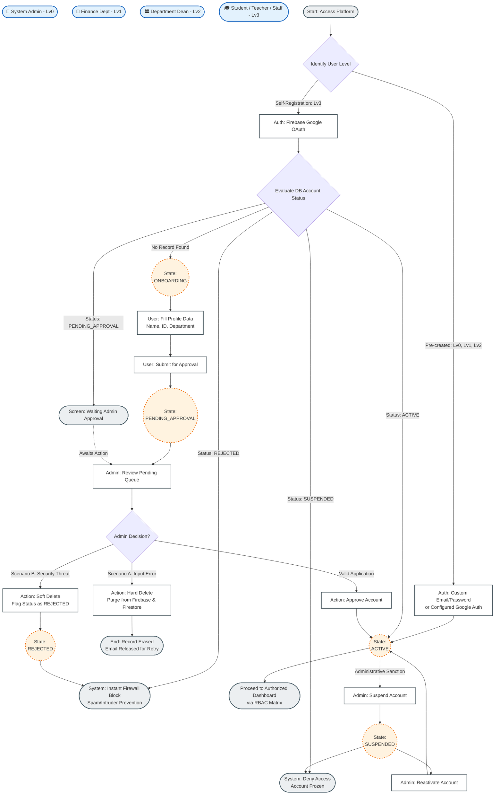

# School Expense Ecosystem

An enterprise-grade, full-stack, distributed **Micro Front-End (MFE)** and **Domain-Driven Architecture** platform designed to manage institutional university budgets and multi-level expense approvals. 

Built inside an **Nx Monorepo Workspace**, the ecosystem coordinates a secure host environment, modular frontend micro-apps, and a decoupled, resilient NestJS cloud backend.

---

## 🏛️ Architectural & System Design

This platform enforces a strict **Role-Based Access Control (RBAC)** matrix across four distinct tiers of user hierarchy (Level 0 to Level 3) combined with real-time financial budget tracking denominated in New Taiwan Dollars (NTD/TWD).

### 🔑 Key Enterprise Features
*   **Federated Micro Front-Ends:** Angular controls the robust Shell host application (routing, global guards, UI layout), while React drives granular remote sub-apps (UI features, interactive dashboard widgets) seamlessly wrapped together using Webpack Module Federation.
*   **Immutable Financial Auditing:** Built-in decoupled infrastructure layer tracking system executors (`admin-executor`) and transaction logs asynchronously written to Cloud Firestore (`firebase-audit-log.repository`).
*   **Anti-Spam Security Firewall:** Defensive middleware filtering logic inside NestJS coupled with Firebase OAuth to immediately block unauthorized registration, isolate bad inputs with hard purges, and drop malicious attempts via an active database blacklist entry.

---

## 🔄 Core Workflows

### User Lifecycle & Onboarding State Machine
The diagram below illustrates how public users authenticate via Firebase OAuth, transition through mandatory onboarding guards, and undergo administrative auditing before obtaining platform permissions.


## 📂 System Topology & Library Boundaries

The workspace uses an elegant Domain-Driven structure managed entirely by Nx. Pure business capabilities are isolated strictly into decoupled functional libraries (`libs/`), preventing dependency bleeding and optimizing computational cache hits during builds.

```text
school-expense-ecosystem/
├── 📱 apps/
│   ├── mfe-shell-angular/      # 🏠 Main Host Portal (Angular Shell, Guard, RBAC Routing)
│   ├── mfe-remote-react/       # 🧩 Remote Micro-App (React Features, Data Visualization)
│   ├── backend/                # ⚙️ Decoupled API Server Engine (NestJS App Engine)
│   ├── mfe-shell-angular-e2e/  # 🧪 End-to-End Test Suite for Host Layer (Cypress)
│   ├── mfe-remote-react-e2e/   # 🧪 End-to-End Test Suite for Remote Layer (Cypress)
│   └── backend-e2e/            # 🧪 Integration End-to-End Test Suite for Core APIs (Jest)
│
├── 📦 libs/
│   ├── 👥 admin/               # Administrative Business Context (User Lists, Controls)
│   ├── 🔐 auth/                # Identity & Security Engine (Guards, JWT Strategies, Interceptors)
│   ├── 📊 dashboard/           # Metrics & Aggregations Data Domain
│   ├── 💰 expenses/            # Expense Claim Workflows (Requests, File Compressors, Audits)
│   ├── 🏛️ finance/             # Fiscal Control Domain (Budget Allocation, Department Caps)
│   └── 🛠️ shared/              # Central System Infrastructure (Firestore Modules, Tokens, Core Cross-Cutting Utils)
│
├── firebase.json               # Cloud Resource Maps
├── nx.json                     # Smart Monorepo Graph Directives
├── package.json                # Explicit Workspace Manifest
└── tsconfig.base.json          # Root Inheritance Path Rules
```

## 🛠️ Technological Blueprints
```text
Frontend Ecosystem: Angular (v18+), React (v18+), TypeScript, Native SCSS Modules, Angular Signals State Store, Webpack Module Federation, ApexCharts Engine.

Backend Ecosystem: NestJS Server Framework, Clean Architecture Core Patterns, Passport JWT Security, Custom Performance Throttlers.

Infrastructure & Tooling: Nx Workspace Orchestrator, Firebase Auth Provider, Cloud Firestore NoSQL Instance, Yarn Workspaces.

Verification Foundations: Jest for isolated Unit Testing, Cypress for browser-level behavioral Automation, Storybook for UI isolated component specification.
```

## 🚀 Execution & Vitals
Prerequisites
```text
Node.js: v18.x or higher

Yarn Workspace: npm install -g yarn (Required package manager)

Nx Workspace CLI: npm install -g nx (Highly recommended global utility)

```
